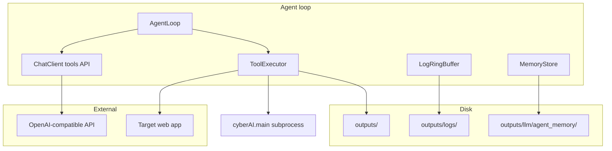

# Closed-loop security agent — architecture

This document describes the **agent loop** integrated with CyberAI: an LLM that can call **tools** (pipeline phases, read artifacts, HTTP probes, memory, logs), with **persistent memory**, **log capture**, and **safety boundaries**.

## Goals

1. **Closed loop**: model proposes actions → system executes **allowlisted** tools → results return to the model → repeat until `finish` or max turns.
2. **Full run memory**: transcript + episodic memory on disk under `outputs/llm/agent_memory/`.
3. **Operational visibility**: recent log lines from `outputs/logs/` injected each turn (not a kernel-level “every line” tap, but **effective** for assessment runs).
4. **Persistent learning (pragmatic)**: append-only **episodes** and **facts** the model records via `memory_save`; optional future export to RAG/Chroma (not required for MVP).

## Non-goals

- Arbitrary shell (`rm -rf`, `curl` to any host).
- Unscoped file read (paths must resolve under `OUTPUT_DIR`).
- Guarantee of finding vulnerabilities or zero false positives.

## Component diagram



## Tool catalog (MVP)

| Tool | Purpose | Safety |
|------|---------|--------|
| `run_pipeline_phase` | Run `python -m cyberAI.main {recon\|plan\|test\|verify\|report}` with `--target` / `--run-id` / optional `--categories` | Subprocess allowlist only; no shell; timeout |
| `read_artifact` | Read a text/JSON file under `OUTPUT_DIR` (relative path) | Path canonicalized; size cap; deny `..` |
| `list_artifacts` | List files under a subdirectory of `OUTPUT_DIR` | Depth/entry limit |
| `get_recent_logs` | Last *N* lines from log files matching `*_{run_id}.log` or glob | Only under `outputs/logs` |
| `http_probe` | GET/HEAD to URL | Must be same host as `TARGET_URL` (or explicit allowlist) |
| `memory_save` | Append structured note (fact, hypothesis, error) to persistent store | Max length |
| `memory_load` | Return recent memory summary for context | — |
| `finish` | End loop with summary reason | Terminal |

## LLM integration

- Uses **OpenAI-compatible** `POST /v1/chat/completions` with `tools` + `tool_choice="auto"` when the provider supports it (OpenRouter, OpenAI, many others).
- If the response has no `tool_calls`, the loop treats assistant text as reasoning and continues until max turns or explicit stop.
- **Transcript**: every turn appended to `outputs/llm/agent_memory/transcript_{run_id}.jsonl` (role, content, tool_calls, tool_call_id).

## Log “every line” semantics

- **Per run**, loguru writes to `outputs/logs/{phase}_{run_id}.log`.
- Each agent turn calls `get_recent_logs` implementation that **tails** matching files (last *K* lines, configurable). This gives the model **fresh stderr/log context** without streaming the entire history every token (bounded cost).

## Persistent memory semantics

- **Episodic**: JSONL transcript (full audit).
- **Semantic scratchpad**: `memory.jsonl` per engagement with `{ts, kind, text}` entries written only via `memory_save`.
- **Not** automatic fine-tuning; “learning” means **retained notes** the next turn and future runs can `memory_load` by `engagement_id` if we extend (MVP: same `run_id` session).

## Configuration

| Env / Config | Meaning |
|--------------|---------|
| `AGENT_MAX_TURNS` | Max tool rounds (default 24) |
| `AGENT_LOG_TAIL_LINES` | Lines of log to inject (default 80) |
| `LLM_ENABLED` | Must be true for agent |
| `TARGET_URL` | Scope for `http_probe` |

## CLI

```bash
python -m cyberAI.main agent --target https://example.com [--run-id ID] [--max-turns 30] [--goal "text"]
```

## Threat model

- Operator trusts the repo + `.env`; agent cannot escape `OUTPUT_DIR` for reads or invoke commands outside `cyberAI.main` allowlist.
- `http_probe` restricted to target host to prevent SSRF abuse from the agent itself.

## Future extensions

- Tool: `rag_query` (Chroma + KB).
- Tool: `submit_finding` (append to `testing/findings/` with schema).
- Stream logs via background thread into a ring buffer for sub-second freshness.
- Provider fallback: parse JSON tool calls from markdown when `tools` unsupported.
